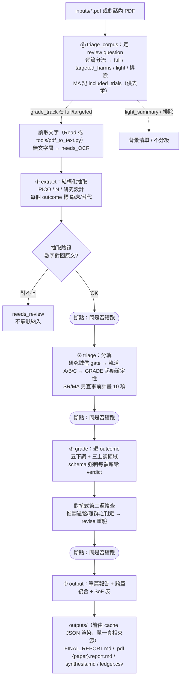
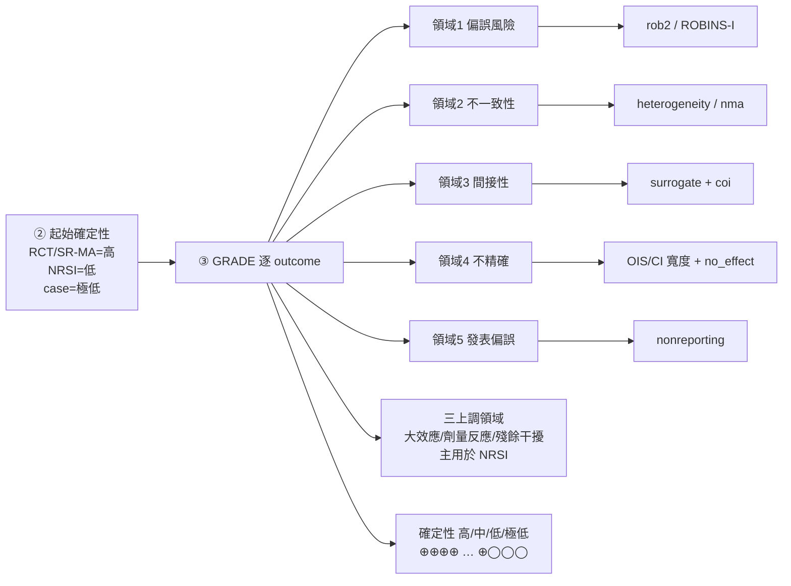

# EBM_Analysis

可重現的 EBM（實證醫學）文獻評讀引擎。**運算引擎＝Claude 本身**（在 Claude Code／Cowork／Chat 內執行），不呼叫任何外部 API。把「不漏步、不自行簡化」的保證放在 **結構化規格＋JSON Schema 驗證**，由 Claude 逐階段遵循；所有人讀報告（含 PDF）一律由 **單一份 cache JSON 渲染**，永不與判定漂移。

## 用法（單一入口：EBM_Search）
本子計畫是 **EBM_Framework 管線的下游評讀階段，不獨立啟動**——已**取消 `/ebm`、「以EBM方式分析」等獨立觸發**。EBM 評讀一律**由 EBM_Search 完成檢索＋交叉驗證後接力進入**：在 EBM_Search 收尾時回「**繼續（進入 EBM 分析）**」，Phase 0 會用其交接包 `_corpus_seed.json` 自動把全文 PDF 複製進 `inputs/`、預填分流草稿（免手動搬檔、免重定 PICO），仍在 Phase 0 斷點覆核 → 逐階段評讀、產出單篇報告＋跨篇統合＋最終報告（.md / .pdf）。流程見 [`../INTEGRATION.md`](../INTEGRATION.md)。

> 為何單一入口：確保被評讀的證據都先經 EBM_Search 去幻覺、查證來源、鎖定必含軸；未經檢索就要直接評讀 PDF 時，`ebm` skill 會導引先走 EBM_Search。

## 結構
```
manifest.yaml         ← 中央地圖：執行順序、護欄→GRADE 領域映射、觸發條件
phases/ (6)           ← 編排層；用 id 引用護欄、不重複內文
  00_global.md  00_triage.md（Phase 0 corpus 分流）
  01_extract.md  02_triage.md  03_grade.md  04_output.md
guardrails/ (28)      ← 護欄正本（含 frontmatter：觸發條件、餵哪個 GRADE 領域）
schema/ (5)           ← ★ 完整性強制層：每階段 JSON Schema（缺欄＝不合格）
  phase0_corpus  phase1_extract  phase2_triage  phase3_grade  phase4_output（含 SoF／報告欄位）
tools/                ← 無 API 的確定性輔助（Claude Code/Cowork 用）
  ingest_seed.py（★交接層：吃 EBM_Search 的 _corpus_seed.json → 複製 PDF 進 inputs/ ＋ 預填 Phase 0 草稿）
  pdf_to_text.py   validate.py（schema＋GRADE 確定性算術重算）
  build_reports.py（單一真相來源：由 cache JSON 渲染 FINAL_REPORT.md＋synthesis.md＋各篇報告＋ledger）
  audit_consistency.py（跨篇判定分歧稽核）
  absrisk.py（由相對效應＋基線算對應風險／風險差／NNT 及其 95% CI／率差）
  archive_run.py（把一次評讀歸檔到 runs/）
calibration/          ← 對外部 GRADE 的校準參考（如 Emara 2025）
ANALYSIS_SPEC.md      ← 評讀規格正本（由 EBM_Framework/.claude/skills/ebm-analysis 啟動器載入；不再獨立 /ebm）
inputs/               ← 放 PDF（一篇一檔）— 不進公開 repo
cache/                ← {paper}.p1..p4.json ＋ _corpus / _synthesis（Claude 逐階段產出並驗證）— 不進 repo
outputs/              ← FINAL_REPORT.md(.pdf)、{paper}.report.md、synthesis.md、ledger.csv — 不進 repo
```

## 分析方法與流程

四階段（前置 Phase 0），**每階段一個斷點**（跑完摘要、詢問是否續跑）。每階段由 Claude 直接執行、輸出受對應 JSON Schema 強制；人讀報告皆由 cache JSON 渲染。



**第三階段 GRADE：五下調領域各吃一條護欄為輸入**（schema 要求逐 outcome、逐領域都有判定）：



**三項保證的機制：**
- **不漏護欄**：`schema/phase3_grade.json` 要求每 outcome 對五下調＋三上調逐一給 `verdict`＋`rationale`。完整模式用 `tools/validate.py` 驗證 Claude 的輸出，缺欄即補；行內模式靠逐項自檢。
- **不自行簡化**：護欄觸發條件由 `manifest.yaml` 宣告，Claude 逐階段讀對應 `guardrails/*.md` 全文套用。
- **可重現／永不漂移**：每階段輸出存 `cache/*.json`，可續跑、可重跑單篇；**FINAL_REPORT.md 與 PDF 都由 `cache/_synthesis.json`（＋`_corpus.json`）自動渲染**——改判定只動 JSON、跑 `build_reports`／PDF 生成，報告與判定永遠同步。

## 近期強化

**v6.1–v6.2（方法學／評分品質）**
1. **Phase 0 corpus 分流**（`phases/00_triage.md`＋`schema/phase0_corpus.json`）：先定 review question、判每篇相關性/角色，只對樞紐療效 RCT＋MA 走完整 GRADE，機制/PK/綜述/離題標背景或排除。
2. **抽取驗證做實**（`schema/phase1_extract.json`）：每筆關鍵數字附原文逐字 `quote`＋`data_source`（full_text/registry/abstract/ai_synthesis）。
3. **誠信查核 routine 實查**（`guardrails/integrity_check.md`）：有網路一律 WebSearch 查撤稿/勘誤、附 PMID/DOI。
4. **跨篇一致規則成文**（`guardrails/extraction_conventions.md`）：多臂/AE 粒度/效應量選擇/方向標準化。
5. **對照校準**（`calibration/`）：以 corpus 內作者自做 GRADE 的 MA（Emara 2025）作為外部對答案靶。
6. **重疊去重**（`overlap_indirect`＋Phase 0 `included_trials`/`overlap_with`）：統合只計去重後的「獨立證據單位」。
7. **登錄庫補救**（`guardrails/registry_backfill.md`）：只有摘要/AI 合成時，固定查 ClinicalTrials.gov API / PROSPERO / FDA-EMA 補齊 RoB/各臂 N/AE。
8. **GRADE 確定性算術重算**（`tools/validate.py`）：從各領域 verdict 重算 `certainty_final`，不符即擋。
9. **評分規則成文**（`guardrails/grading_rules.md`）：imprecision 操作門檻、階層檢定→GRADE、多劑量不一致、COI 何時真的下調。
10. **跨篇一致性稽核**（`tools/audit_consistency.py`）：同類 outcome 並排、標出判定分歧。
11. **對抗式第二遍複查**（`guardrails/adversarial_review.md`）：Phase 3 後以「懷疑者」重跑、推翻過鬆/離群/未驗證即當低偏誤之判定；revise 則回改重驗。

**v6.3（依 Cochrane Ch14 補上招牌輸出＋完整度）**
12. **Summary of Findings 表 ＋ 絕對效應**（`guardrails/sof_table.md`＋phase4 `sof`＋`tools/absrisk.py`）：標準 SoF 表（≤7 結果），二分類**相對＋絕對並列**（對應風險、風險差、NNT）、率結果報率差。
13. **選擇性報告查核**（`guardrails/selective_reporting.md`）：比對註冊 vs 發表 outcomes，偵測 outcome switching，餵 RoB 領域5／非報告偏誤。
14. **報告完整度**（`guardrails/report_completeness.md`）：強制納入研究特徵表、RoB 2 逐領域摘要、發表偏誤聲明、次群組意涵、基準風險分層；`guardrails/harms.md` 補回 AE「系統性 vs 非系統性收集」層（Ch5 §5.3.5.1）。

**v6.4（單一真相來源＋相關回顧品質）**
15. **單一真相來源報告**：`build_reports.py` 連 FINAL_REPORT.md 一起由 `cache/_synthesis.json` 自動生成，PDF 亦讀同一份 JSON——`.md` 與 `.pdf` 同源、改一次同步、永不漂移。
16. **相關 SR/MA 之 AMSTAR 2 評估**（`guardrails/amstar2.md`＋phase4 `related_reviews`）：對報告納入/參考的 SR/MA 評 AMSTAR 2 七個關鍵領域＋整體信心，獨立呈現為「相關系統性回顧／統合分析特徵表」，**與 4-RCT 納入研究特徵表分離**（Cochrane study vs review 單位區分），去重後不與個別 RCT 結論疊加。
17. **NNT 信賴區間**（`tools/absrisk.py`）：由 RR 95% CI×對照基線回推 NNTB 95% CI（CI 未跨無效線時無不連續性問題）。

> ⚠️ **誠實限制**：在「Claude 即引擎」模式下判斷仍由 Claude 做。已用 schema 結構＋GRADE 算術重算＋跨篇 audit＋對抗式複查多道把關，但**複查者仍是同一個 Claude、非真正獨立第二方**；逐字 `quote` 若來自 AI 合成摘要為二手。

## 方法學依據（對照 Cochrane Handbook v6.5）

流程已逐條對照本機 Cochrane Handbook 章節筆記查核，結構核心與原文相符（v6.4 另抽驗 Ch10 異質性分段／Chi² P=0.10／meta-迴歸<10、Ch8 5-and-20 棄用／10% 缺失翻倍範例，皆與原文一致）：

| 流程環節 | Handbook 依據 | 查核 |
|---------|--------------|------|
| 起始確定性（RCT/SR-MA=高、NRSI=低、ROBINS-I 可起始高但一般降兩級） | Ch14 §14.2.1、Fig 14.2.a | ✅ |
| 軌道為設計分流、不以樣本量/期刊判定（樣本量走 imprecision） | Ch14 §14.2.2(4)、Table 14.1.a | ✅ |
| 逐 outcome 評定；五下調（各 −1、非常嚴重 −2、至多 −3） | Ch14 §14.2.1–14.2.2、MECIR C74/C75 | ✅ |
| 三上調（大效應 RR>2/<0.5、劑量反應、殘餘干擾） | Ch14 §14.2.3 | ✅ |
| RoB 2→GRADE 映射（低/some concerns/高 → Table 14.2.a） | Ch14 Table 14.2.a、Ch8 | ✅ |
| RoB 2 整體＝最不利領域、result-level、ITT 預設、5-and-20 棄用 | Ch8 §8.2.2/§8.2.4/§8.5.2 | ✅ |
| 異質性 I² 非硬切點、避免簡單門檻、Chi² 用 P=0.10 | Ch10 §10.10.2、MECIR C63 | ✅ |
| 不精確 OIS/CI、CI 同時相容益處與危害 → 降 | Ch14 §14.2.2(4) | ✅ |
| no evidence of effect ≠ evidence of no effect、禁統計顯著二分 | Ch15 §15.3 MECIR C72 | ✅ |
| 計票三層（首選 MA／可接受方向計票・合併P・摘要效應／不可接受顯著性計票） | Ch12 §12.2 | ✅ |
| NNT/RD 信賴區間由 RR/OR 之 CI 代入導出、對一系列基線表達 | Ch15 §15.4 | ✅ |
| 相關 SR/MA 以 AMSTAR 2／ROBIS 評質、與原始研究分離 | Ch V | ✅ |

**已知簡化（非錯誤，設計取捨）**：GRADE 嚴格上是對「某 outcome 的整份證據體」評定確定性（Ch14 §14.2.1）。本引擎為**逐篇**評定、再於第四階段統合——單篇 GRADE 應讀作「該研究的證據」，跨研究的證據體層級在 `synthesis.md`／`FINAL_REPORT.md` 形成。

**精簡損失盤點（已查核）**：規格曾從單一 prompt 重構為模組化護欄。對照原始版本確認所有實質方法學規則 100% 保留、且抽驗 Handbook 無漂移；僅各規則的引註出處（章節尾註）未隨附於護欄，原文留存於 git 早期 commit。

## 如何執行
**由 EBM_Search 接力進入**（在 Claude Code／Cowork／Chat 內）：先用 EBM_Search 對主題做檢索＋交叉驗證，收尾時回「**繼續（進入 EBM 分析）**」→ Claude 逐階段評讀、每階段問你是否續跑。已**取消 `/ebm` 獨立啟動**（理由見「用法」）。

完整模式（Claude Code/Cowork）會用到 `tools/`（一次性安裝）：
```bash
pip install -r requirements.txt   # jsonschema / pyyaml / pymupdf（無需 API key）
```
- `python tools/pdf_to_text.py`：把 inputs/ 的 PDF 抽成 cache/*.txt
- `python tools/validate.py p3 cache/<paper>.p3.json`：驗證某階段輸出是否符合 schema
- `python tools/build_reports.py`：把 cache/*.json 渲染成 outputs/ 報告（FINAL_REPORT.md／synthesis.md／各篇／ledger）
- `python tools/absrisk.py rr 1.20 0.403`：由相對效應＋基線算對應風險／風險差／NNT

## 進度
- [x] 規格結構化（phases / guardrails / schema / manifest）
- [x] 方法學對照 Cochrane Handbook 查核（無結構性錯誤）＋精簡損失盤點（規則 100% 保留）
- [x] 「Claude 即引擎」模型（無 API）＋ ebm skill（由 EBM_Search 接力啟動）＋ 階段斷點 ＋ 無 API 輔助工具
- [x] v6.1–v6.4 強化（Phase 0、registry_backfill、grading_rules、算術重算、audit、對抗式複查、SoF、report_completeness、AMSTAR 2、NNT CI、單一真相來源報告）
- [x] **真實 corpus 端到端實跑驗證**：21 篇 DPP-1/支氣管擴張 → 4 樞紐 RCT 完整 GRADE ＋ 統合 ＋ Emara MA 校準 6/6 吻合
- [x] 內容待辦 AMSTAR 2 已落地（`amstar2` guardrail＋`related_reviews`）
- [ ] 內容待辦剩：DTA(QUADAS-2) / ROBINS-I / 預後 / MID（新增 guardrail .md＋schema 欄位即可承接）
- [ ] 強化獨立第二方驗證（對抗式複查目前仍同一 Claude）
